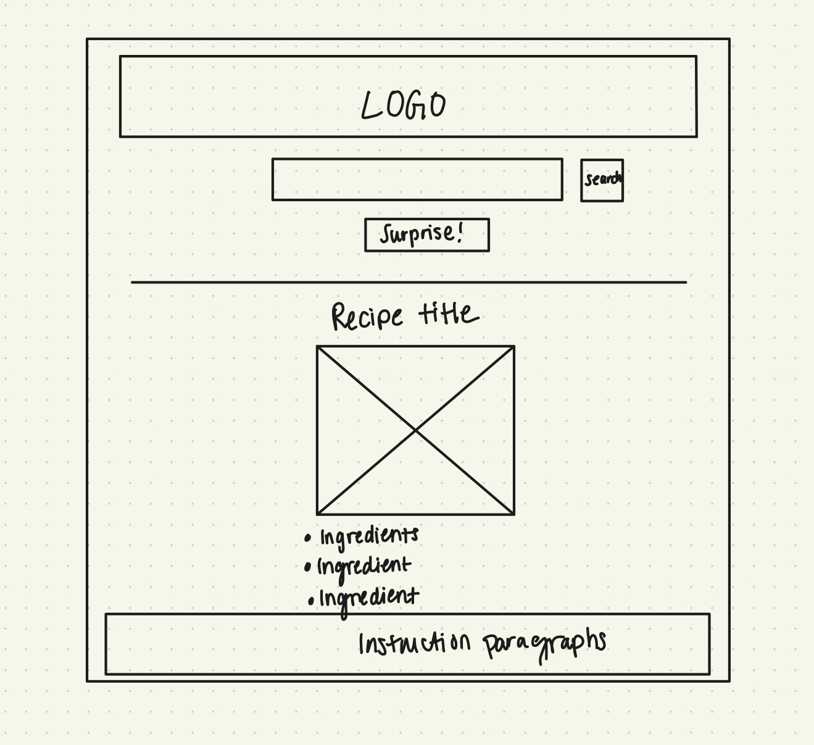
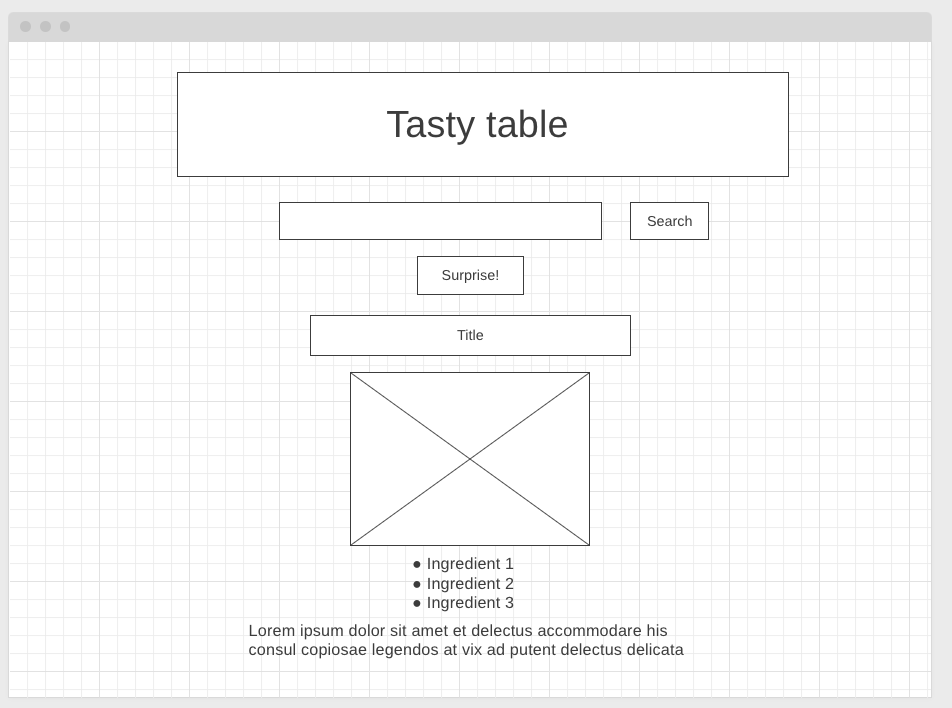

# Project_1_tasty_table
The goal for Project 1 is to use theMealDB API to create a user friendly site for recipes! 

A trello board was created that outlined what steps needed to be completed by the end of each day. This board was updated daily to maintain organization and meet deadlines throughout the project. 
[Trello](https://trello.com/b/6yXSm1qc/project-1-tasty-table)

Along with this, a general layout of the website was formed on goodnotes to have a rough draft on layout and user interactions.

A low-fidelty wireframe was also created to plan where each element would best be placed. Once the inital groundwork was complete, a basic HTML layout was created and javascript logic could begin. 

Using theMealDB API, two different features were formed. The user can enter a meal into the input bar and search for a specfic recipe. If the user does not know what meal they want, they can press the "surprise me!" button which pulls displays a random recipe. The meal recipe displays its corresponding name, ingredients with their measurements, and instructions on how to prepare the meal. This was done using fetch calls to request data from the API, and have the response displayed on screen. 

Once the javascript was complete, CSS was used to style the website and make a clean user friendly site.

Deployed website: tricky-smile.surge.sh
Surge is only allowing the search button to work and not the "surprise me!" button. It works on my local file. 
